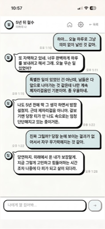
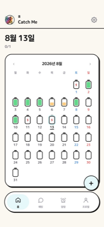
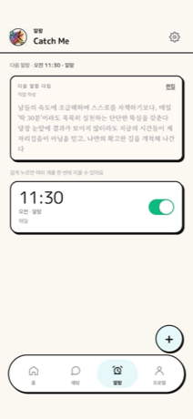
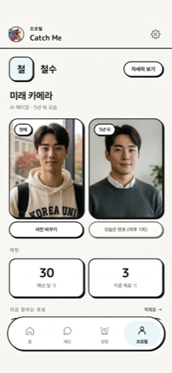

<div align="center">

# Catch Me.

**5년 뒤의 나와 대화하고, 그 대화에서 나온 다짐을 목표 · 할 일 · 알람으로 옮기는 iOS 앱**

[](https://apps.apple.com/kr/app/id6798162633)


**[App Store에서 받기](https://apps.apple.com/kr/app/id6798162633)** · [지원](https://future-me-studio.vercel.app/support.html) · [개인정보 처리방침](https://future-me-studio.vercel.app/privacy.html)

<br>






</div>

<br>

## 어떤 앱인가

자기계발 앱은 **할 일을 관리**해 줍니다. 그런데 사람이 흔들리는 이유는 관리가 안 돼서가 아니라, 오늘의 행동이 **되고 싶은 자신**과 어떻게 이어지는지 느껴지지 않기 때문입니다.

Catch Me는 온보딩에서 "5년 뒤의 나"를 한 줄 목표가 아니라 **하루의 장면과 거기까지 도달한 서사**로 쓰게 합니다. 그러면 AI가 그 사람이 되어, 예언이 아니라 **"그때는 나도 그랬는데, 지나와 보니 —"** 톤으로 대화합니다.

그리고 대화에서 나온 말을 길게 누르면 **계획표로 넘어갑니다.** 목표 → 루틴 → 알람으로 이어지고, 완료 회고가 다시 대화의 맥락으로 돌아옵니다.

| 기능 | 설명 |
| --- | --- |
| **미래의 나와 대화** | 온보딩 답변으로 만든 페르소나가 내 말투를 학습해 1:1로 대화합니다 |
| **목표 · 할 일 · 루틴** | 목표를 "왜 이루려는지 · 이룬 모습 · 5년 뒤의 나와의 연결"로 저장하고 오늘의 행동으로 쪼갭니다 |
| **AI 알람** | iOS 26 AlarmKit으로 무음·방해금지에서도 울리는 시스템 알람 + 미래의 나가 보내는 한 마디 |
| **미래 사진** | 사진 한 장으로 5년 뒤 내 모습을 AI가 생성합니다 |

<br>

## 어떻게 만들었나

React로 만든 웹앱을 **Capacitor로 감싼 iOS 앱**이고, 서버는 **Supabase**를 씁니다. AI 키는 앱에 넣지 않고 **서버가 대신 호출**합니다.

```
┌─ iOS 앱 ─────────────────────────────────────────────┐
│  Capacitor WebView            futureme-alarm (Swift) │
│  React 19 · TypeScript   ↔    AlarmKit · App Intents │
└──────────────────────────┬───────────────────────────┘
                           │  로그인 토큰(JWT)
┌─ Supabase ───────────────┴───────────────────────────┐
│  Auth              Postgres            Edge Functions│
│  Apple · Google    RLS로 본인만 접근    AI 프록시 외 4개 │
└──────────────────────────┬───────────────────────────┘
                           │  서버가 보관한 키
                    Google Gemini
```

**AI 키를 클라이언트에 두지 않습니다.** 사용자는 로그인만 하면 되고, 서버가 토큰을 검증한 뒤 모델 허용 목록과 일일 사용량을 확인하고 호출합니다. 이 구조가 다시 깨지지 않게 [요청 본문에 키가 없음을 확인하는 테스트](tests/aiProxyRequest.test.ts)를 두었습니다.

**알람은 직접 만든 네이티브 플러그인**으로 동작합니다. iOS 26 AlarmKit을 쓰는 Capacitor 플러그인이 없어서 Swift로 작성했습니다. 알람이 울릴 때 앱은 실행 중이 아니므로, 네이티브가 자체 저장소를 갖고 앱이 다시 뜰 때 그동안의 일을 JS에 전달합니다.

<br>

## 저장소 구조

```
Catch Me.
├── src/                  프론트엔드 (React 19 + TypeScript)
│   ├── components/         화면 — 채팅 · 온보딩 · 플래너 · 설정
│   ├── lib/                핵심 로직 ★ 아래 "코드 둘러보기" 참고
│   ├── types/              데이터 모델
│   ├── hooks/  contexts/   상태 관리
│   └── goals/  styles/     플래너 화면과 스타일
│
├── ios/                  Xcode 프로젝트 (Capacitor)
├── plugins/
│   └── futureme-alarm/     직접 만든 Swift 알람 플러그인 (AlarmKit)
│
├── supabase/
│   ├── functions/          Edge Functions — AI 프록시, 계정 삭제, 푸시
│   └── migrations/         DB 스키마와 RLS 정책
│
├── tests/                bun test — 48개 파일
├── eval/                 AI 응답 품질 회귀 검사
├── scripts/              App Store 제출 자동화 (App Store Connect API)
├── docs/                 상세 문서 ↓
│
├── index.html            채팅 화면 진입점
└── goals.html            플래너 화면 진입점
```

### 코드 둘러보기

전체를 보실 필요는 없습니다. **이 다섯 개**만 보시면 설계 판단이 대부분 보입니다.

| 파일 | 무엇을 보게 되는가 |
| --- | --- |
| [`src/types/self.ts`](src/types/self.ts) | 데이터 모델. **여기서 시작**하면 나머지가 빨리 읽힙니다 |
| [`src/lib/selfEngine.ts`](src/lib/selfEngine.ts) | `buildSystemPrompt` — 페르소나가 만들어지는 핵심 |
| [`src/lib/geminiApiKey.ts`](src/lib/geminiApiKey.ts) | 흩어진 AI 키 조달을 한 지점으로 모은 설계 |
| [`plugins/futureme-alarm/.../AlarmKitBridge.swift`](plugins/futureme-alarm/ios/Sources/FutureMeAlarmPlugin/AlarmKitBridge.swift) | 네이티브 알람 브릿지 |
| [`src/lib/syncOrchestrator.ts`](src/lib/syncOrchestrator.ts) | 로컬 ↔ 클라우드 병합 규칙 |

> 주석은 "무엇을 하는지"가 아니라 **"왜 이렇게 했는지, 무엇을 시도했다가 실패했는지"**를 적는 규칙으로 썼습니다. 설계 의도를 보시려면 주석을 함께 읽어 주세요.

<br>

## 직접 실행해보기

```bash
bun install
cp .env.example .env     # Supabase를 쓰려면 값 입력 (로그인 없이도 동작합니다)

bun run dev              # 플래너 화면부터
bun run dev:chat         # 채팅 화면부터
bun test                 # 테스트
```

**iOS 빌드**

```bash
bun run build:ios        # 웹 빌드 + 플러그인 동기화 + cap sync
bun run ios:open         # Xcode 열기
```

<br>

## 기술 스택

| 영역 | 사용 기술 |
| --- | --- |
| 프론트엔드 | React 19 · TypeScript · Vite 8 · Tailwind CSS 4 |
| iOS | Capacitor 7 · Swift (AlarmKit, App Intents) · iOS 26+ |
| 백엔드 | Supabase — Auth · PostgreSQL + RLS · Edge Functions (Deno) |
| AI | Google Gemini (Edge Function 프록시 경유) |
| 알림 | Web Push (VAPID) · AlarmKit |
| 도구 | Bun · Oxlint · Xcode Cloud · App Store Connect API |

<br>

## 더 읽을 문서

| 문서 | 내용 |
| --- | --- |
| [**docs/ARCHITECTURE.md**](docs/ARCHITECTURE.md) | 온보딩 질문 설계, 프롬프트 조립, 동기화 규칙 등 **전체 상세 설명** |
| [docs/PRODUCT_PRINCIPLES.md](docs/PRODUCT_PRINCIPLES.md) | 기능을 넣을지 말지 판단하는 기준 |
| [docs/ROADMAP.md](docs/ROADMAP.md) | 다음 과제와 우선순위 |
| [docs/SUPABASE_SETUP.md](docs/SUPABASE_SETUP.md) · [docs/APPLE_SIGN_IN.md](docs/APPLE_SIGN_IN.md) | 로그인·백엔드 설정 |
| [docs/IOS_NATIVE_ALARM.md](docs/IOS_NATIVE_ALARM.md) · [docs/ALARM_WHEN_APP_CLOSED.md](docs/ALARM_WHEN_APP_CLOSED.md) | 네이티브 알람 구현 기록 |
| [docs/APP_STORE_LAUNCH.md](docs/APP_STORE_LAUNCH.md) | App Store 출시 과정 |
