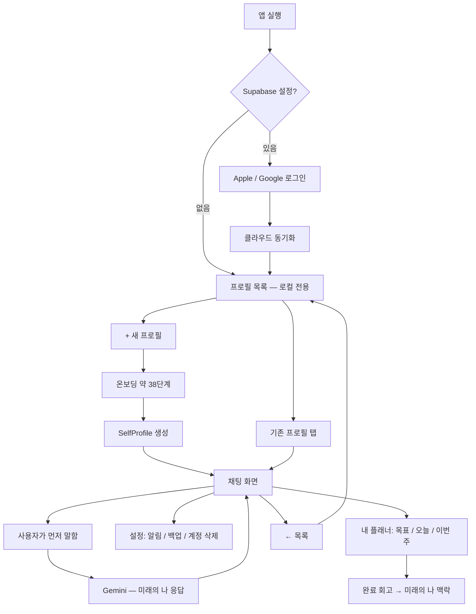
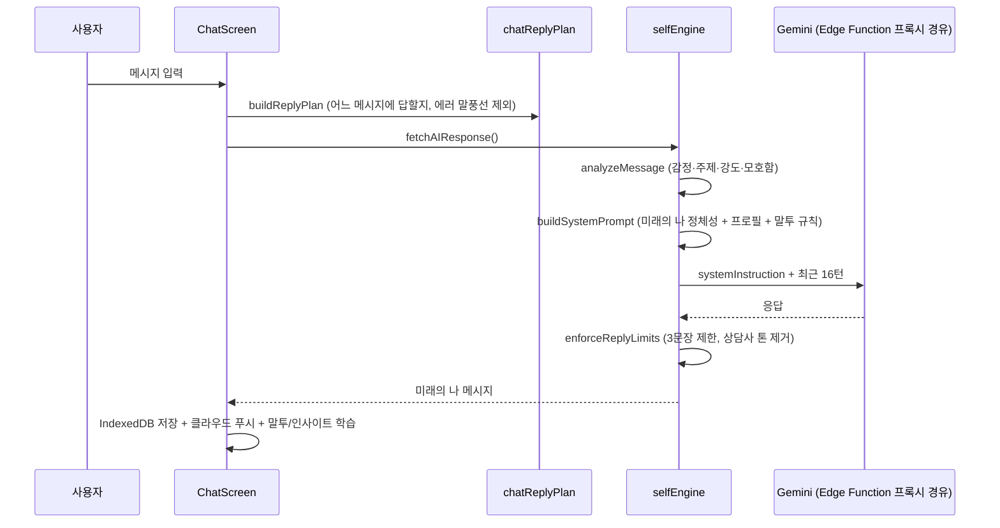

# Catch Me — 상세 설계 문서

> **먼저 [README](../README.md)를 보세요.** 이 문서는 그다음에 읽는 상세 설명입니다.
>
> **다루는 내용:** 온보딩 질문을 왜 이렇게 짰는지, AI가 어떻게 "미래의 나"처럼 말하는지,
> 데이터를 어떻게 저장하고 동기화하는지, 네이티브 알람과 출시 과정은 어떻게 만들었는지
>
> **대상:** 코드를 직접 고치거나 설계 판단의 근거를 확인하려는 사람
> **최종 업데이트:** 2026-08-23

---

## 1. 한 줄 요약

**Catch Me**는 온보딩에서 "지금의 나"와 "5년 뒤 되고 싶은 나"를 입력하면, **Gemini**가 그 **미래의 나 페르소나**가 되어 카톡처럼 대화해주는 앱이다. 대화에서 나온 다짐을 목표·할 일·루틴·알람으로 이어 실행까지 붙인다. React 웹앱을 **Capacitor로 감싼 iOS 앱**으로 App Store에 출시했다.

- 사람의 의지는 날마다 흔들린다 → **이미 그 길을 지나온 5년 뒤의 나**가 북돋아준다
- 예언·점쟁이가 아니라, "그때는 나도 그랬는데, 지나와 보니 —" 톤의 **경험자**
- 프로필(채팅방)은 **한 개만 새로 만들 수 있다** ([`primaryProfile.ts`](../src/lib/primaryProfile.ts)의 `canCreateProfile`). 자료구조는 여러 개를 담지만 정책상 하나로 묶었다
- **AI 키는 사용자가 넣지 않는다.** 로그인만 하면 서버 프록시가 대신 부른다 (§6-4)
- Apple / Google 로그인 시 **클라우드 동기화**, 로그인 없이도 로컬 전용으로 동작
- 알람은 iOS 26 **AlarmKit**을 쓰는 자체 제작 네이티브 플러그인으로 동작 (§12)

> 이 프로젝트는 자문자답 앱 **TalkBack(톡백)** 을 포크해 방향을 바꾼 것이다. 코드 곳곳의
> `talkback-*`/`aime-*` 상수는 구버전 데이터 마이그레이션용이니 지우면 안 된다.

---

## 2. 왜 이렇게 만들었는가 (설계 의도)

| 목표 | 구현 방식 |
| --- | --- |
| 흔들리는 의지를 붙잡아주는 존재 | AI가 "5년 뒤 목표에 도달한 나"로서 담담하게 말함 (`buildSystemPrompt`) |
| 미래가 생생해야 힘이 됨 | 온보딩에서 평범한 하루(typicalDay), 도달 경로(throughline)까지 구체적으로 수집 |
| 말투가 진짜 나 같아야 함 | 말투 샘플 수집 + 자동 분석(stylometry), 채팅할수록 학습 |
| 자기이해 → 용기 → 실행 | 대화에서 나온 말을 계획표로 보내기(메시지 꾹 누르기), 반복 일정(루틴), 완료 회고 |
| 긴 대화도 맥락 유지 | 최근 16턴 원문 + 이전 대화는 AI 요약으로 압축 |
| 데이터 신뢰 | 삭제 기록(tombstone)으로 "지운 프로필이 되살아나지 않게" 보장, 동기화 실패 시 배너 표시 |

**플래너:** 목표를 `왜 이루려는지 · 이룬 모습 · 5년 뒤의 나와의 연결 · 기간`으로 저장하고, 오늘·이번 주의 행동과 완료 회고로 이어간다. AI는 마일스톤과 이번 주 행동을 **초안으로만 제안**하며, 사용자가 확인하기 전에는 어떤 일정도 저장하지 않는다. 계획을 대신 통제하는 방향은 의도적으로 배제한다.

---

## 3. 사용자 관점 — 앱이 어떻게 흐르는가



**중요한 UX 결정**

- 채팅 시작 시 **자동 인사 없음** → 사용자가 먼저 말해야 함 (몰입감)
- 온보딩 중간 저장 → 브라우저 닫아도 이어서 가능
- 프로필 삭제는 해당 채팅방만 삭제되고, **삭제 기록이 남아** 다른 기기와의 동기화에서도 되살아나지 않음

---

## 4. 온보딩 — 핵심 15문항 + 심화 24문항 (2단 구조)

질문 흐름은 [src/lib/onboardingConfig.ts](../src/lib/onboardingConfig.ts)의 `ONBOARDING_STEPS`로 정의되고, UI는 [ChatOnboarding.tsx](../src/components/onboarding/ChatOnboarding.tsx)가 그린다.

**핵심 코스 (15단계):** 이름 → 나이 → 역할·상황 → 하루하루 → 신경 쓰이는 영역(칩) → **말투 학습 샘플** → 대화 톤 → (미래 전환) → 정체성 한 문장 → 잘 풀렸으면 하는 영역 → **평범한 하루(생생함)** → **미래의 나 말투 샘플** → 편지(adviceLine) → 이번 주 작은 행동 → **분기: "지금 미래의 나 만나기" vs "더 깊게 만들기"**

**심화 코스 (24단계):** 절대 못 놓는 것 → "잘 산다"의 정의 → 가치관 딜레마 → 힘들었던 순간 → 두려움 → 진짜 원하는 것 → 1년 뒤 성장상 → **도달 경로(throughline)** → 직업/루틴/돈/관계/건강/사는 곳 → 성취 → 넘어선 어려움 → 배운 것 → 피하고 싶은 미래 → 될 뻔했던 길 → 별거 아니었던 걱정 → 변한 성격 → 자아 연속성 → 자주 물을 주제

핵심 코스는 [personaModel.ts](../src/lib/personaModel.ts)의 **core 티어**(없으면 페르소나가 남처럼 말하는 필드)를 채우는 최소 질문이다. 건너뛴 질문은 프로필의 **페르소나 채우기**(충실도 % + 추천 질문)에서 언제든 이어서 채울 수 있고, 답변은 말투 학습에도 반영된다.

설계 원리: 미래를 **한 줄 목표**가 아니라 **하루의 장면과 도달 서사**로 쓰게 하면 페르소나가 살아난다. 질문을 바꾸려면 `ONBOARDING_STEPS` 배열만 수정하면 된다.

---

## 5. 데이터 모델 ([src/types/self.ts](../src/types/self.ts))

```
SelfProfile ─── 프로필(채팅방) 하나의 전체 데이터
├─ 지금의 나: name, age, currentRole, lifeContext, concernDomains,
│             fear/desire/avoidance/growthDirection, corePriority, successDef …
├─ future: FutureSelfProfile ─── 5년 뒤의 나
│   identityLine, typicalDay, throughline, career, income, relationship,
│   health, achievement, obstacleOvercome, lesson, fearedSelves,
│   futureVoiceSample, adviceLine(+adviceTone), weeklyAction …
├─ 말투: styleSamples(원문) + styleRules(자동 분석 규칙서)
├─ 대화 축적: insights(잠정 관찰), conversationSummary(오래된 대화 요약)
├─ 지난 기록: savedDilemmas(고민), smallActions(작은 행동), futureSelfNotes(메모)
│   — 지금은 새로 쌓지 않는다. 프로필의 "지난 기록"에서 보고 지울 수만 있다
└─ 플래너: goals(목표), milestones(마일스톤), tasks(오늘·주간 행동), reflections(완료 회고)
```

구버전(필드 구조가 다른) 프로필은 `normalizeFutureSelf()`가 자동 변환한다.

---

## 6. AI — "미래의 나"는 어떻게 만들어지는가

핵심 파일: [src/lib/selfEngine.ts](../src/lib/selfEngine.ts)

### 6-1. 한 턴의 처리 흐름



### 6-2. 시스템 프롬프트 (`buildSystemPrompt`)

- **정체성:** "너는 ○○의 5년 뒤(N세) 미래의 나다. AI·상담사·점쟁이가 아니다." 예언 금지, "지나와 보니 —" 톤 강제
- **동적 블록:** 이번 말 분석 결과, 미래 프로필 전체(`describeFutureSelf`), 말투 규칙, 대화 요약, 인사이트
- **답변 모드** (`ReplyMode`): `future`(기본 — 미래의 나 관점) · `reflect`(순수 반영)
- **길이·금지:** 한 턴 최대 3문장, 번호·불릿 금지, user 말 되풀이 금지

### 6-3. 메모리 2단 구조

| 구간 | 처리 |
| --- | --- |
| 최근 16메시지 (lite 모드 10) | API에 원문 전송 |
| 36턴 초과분 | `updateConversationSummary`가 16턴마다 AI 요약으로 압축 |
| 24턴마다 | `analyzeInsightsWithAI`가 가치관·상황을 JSON으로 추론해 축적 |

### 6-4. AI 키 조달 — 앱에 키를 내장하지 않는다

출시 전까지는 사용자가 aistudio에서 직접 키를 발급해 설정에 붙여넣어야 첫 대화가 됐다.
지금은 **서버 프록시**([`supabase/functions/gemini`](../supabase/functions/gemini/index.ts))가
대신 구글을 부르므로, 사용자는 로그인만 하면 된다.

`VITE_GEMINI_API_KEY`로 빌드에 키를 박는 방법은 쓰지 않는다 — Vite가 그 값을 결과물에
글자 그대로 넣어서, 앱 파일을 열거나 네트워크 요청을 보면 키가 `?key=`로 그대로 보인다.

| 층 | 하는 일 |
| --- | --- |
| [`geminiApiKey.ts`](../src/lib/geminiApiKey.ts) `resolveEffectiveApiKey()` | **키를 읽는 유일한 지점.** 채팅·온보딩·플래너·미래사진·알람이 모두 여기를 거치므로 조달 방식을 바꿀 때 이 함수만 고치면 된다 |
| [`aiProxy.ts`](../src/lib/aiProxy.ts) | 키 자리에 `AI_PROXY_KEY` 표식을 돌려주고, **실제로 URL을 만드는 두 곳**에서만 걸러 프록시로 보낸다 |
| Edge Function `gemini` | Supabase JWT 검증 → **모델 허용 목록** 검사 → 사용자별 **일일 쿼터**(글 200회 / 이미지 1회) → 서버가 보관한 키로 구글 호출 |

개인 키는 **개발자 모드**(설정 제목 7회 연속 탭)에서만 넣을 수 있고, 넣으면 프록시보다
우선한다. 일반 사용자에게는 키 입력 UI 자체가 보이지 않는다.

**이 설계는 회귀 테스트로 고정돼 있다.** `tests/apiKeyStaysOnDevice.test.ts`,
`tests/aiProxyRequest.test.ts`(요청 본문 어디에도 `AIza`가 없음을 단정),
`tests/aiProxyRouting.test.ts`가 키 유출 경로를 다시 열지 못하게 막는다.

---

## 7. 저장·동기화 구조

| 데이터 | 저장소 | 키/구조 |
| --- | --- | --- |
| 프로필 목록 인덱스 | localStorage | `futureme-profiles-index` |
| 프로필 본문 | localStorage | `futureme-profile-{id}` |
| **삭제 기록 (tombstone)** | localStorage | `futureme-profile-tombstones` (180일 후 자동 정리) |
| Gemini 모델 선택 | localStorage + 클라우드 | `futureme-gemini-model` |
| Gemini API 키 | **기기 안에만** (localStorage `futureme-gemini-key`) | 개발자 모드에서 넣은 개인 키 전용. 예전에는 [`settingsSync.ts`](../src/lib/settingsSync.ts)가 클라우드로 평문 동기화했으나 **제거했다** — 일반 사용자는 키를 쓰지 않고 서버 프록시로 동작한다 (§6-4) |
| 채팅 전체 기록 | IndexedDB `futureme` | store `chat`, key = `profileId` |
| 온보딩 중간 진행 | localStorage | `futureme-onboarding-v4` |
| 클라우드 (로그인 시) | Supabase | `futureme_profiles`, `futureme_chats`, `futureme_settings` (RLS로 본인만 접근) |

### 동기화 규칙 ([src/lib/syncOrchestrator.ts](../src/lib/syncOrchestrator.ts))

1. 로그인하면 로컬 vs 클라우드를 비교: 한쪽만 있으면 그쪽을 복사, 둘 다 있으면 **updated_at이 최신인 쪽이 승리** (프로필 단위)
2. **삭제는 tombstone으로 전파**: 프로필을 지우면 클라우드 행을 없애는 대신 `{ __deleted: true, deletedAt }` 표식으로 바꾼다. 병합 때 "삭제 시각 vs 수정 시각, 늦은 쪽이 이긴다"(`deletionWins`) — 삭제 후 다른 기기에서 대화를 이어갔다면 부활, 아니면 모든 기기에서 삭제 유지
3. 클라우드 저장이 실패하면 화면 상단에 **"클라우드 저장 실패" 배너**가 뜨고, 다음 저장·동기화 때 자동 재시도된다 ([src/lib/syncStatus.ts](../src/lib/syncStatus.ts))

주의: 채팅은 프로필 단위로 통째로 비교되므로, 두 기기에서 **동시에** 같은 프로필과 대화하면 늦게 저장한 쪽만 남는다. (메시지 단위 병합은 미구현 — §11)

---

## 8. 기술 스택 & 실행

| 항목 | 선택 |
| --- | --- |
| 프레임워크 | React 19 + TypeScript |
| 빌드 | Vite 8 |
| 스타일 | Tailwind CSS 4 |
| 패키지 매니저·테스트 | Bun (`bun test` 내장 러너) |
| iOS | Capacitor 7 (iOS 26+), 자체 제작 Swift 플러그인 `futureme-alarm` |
| AI | Google Gemini — **Edge Function 프록시 경유** (기본 `gemini-3-flash-preview`) |
| 로그인·DB | Supabase (Apple / Google OAuth + Postgres + RLS) |
| 서버 로직 | Supabase Edge Functions 5개 (Deno) |
| 푸시 | Web Push (VAPID) + `push-tick` 크론 |
| CI·배포 | Xcode Cloud (main 푸시 → 자동 빌드 → App Store Connect), Vercel (정책·지원 페이지) |

```bash
cp .env.example .env   # Supabase 쓰려면 값 입력, 로컬 전용이면 그대로 둬도 됨
bun install
bun run dev            # 플래너 화면부터 (http://127.0.0.1:5173/goals.html)
bun run dev:chat       # 채팅 화면부터
bun test               # 테스트 48개 파일
bun run build          # 타입검사 + dist 생성
bun run lint           # Oxlint
bun run chat:eval      # AI 응답 품질 회귀 검사 (§13)
```

**iOS 빌드**

```bash
bun run build:ios      # 웹 빌드 + 플러그인 동기화 + cap sync ios
bun run ios:open       # Xcode 열기
```

- Supabase·로그인 설정: [docs/SUPABASE_SETUP.md](SUPABASE_SETUP.md)
- **AI는 로그인만 하면 동작한다** — 키 입력이 필요 없다 (§6-4)
- 로컬(localhost)과 배포 URL의 로컬 데이터는 분리된다 — 옮기려면 로그인 동기화 또는 백업 JSON

### ⚠️ 커밋 전에 git 이메일부터 (Vercel 배포가 막힌다)

새 컴퓨터에서 `user.email`을 안 정해두면 git이 `이름@맥북이름.local` 같은 가짜 주소를
자동으로 만들어 쓴다. 그 커밋이 main에 올라가면 **Vercel이 배포를 거부한다**
("commit author email is not valid"). 클론하자마자 한 번 설정해두면 된다.

```bash
git config --global user.name "이름"
git config --global user.email "깃허브에-등록된-이메일"
```

이메일은 **GitHub 계정에 등록·인증된 주소**여야 한다 (GitHub → Settings → Emails).
공개하기 싫으면 같은 화면의 `...@users.noreply.github.com` 주소를 쓰면 된다.

---

## 9. 주요 파일 지도

| 파일 | 역할 |
| --- | --- |
| [src/App.tsx](../src/App.tsx) | 화면 전환: 목록 ↔ 온보딩 ↔ 채팅, 동기화 배너 |
| [src/types/self.ts](../src/types/self.ts) | 데이터 모델 (SelfProfile, FutureSelfProfile) ★먼저 읽기 |
| [src/lib/onboardingConfig.ts](../src/lib/onboardingConfig.ts) | 온보딩 질문 정의 — 핵심/심화 2단 (질문 수정은 여기) |
| [src/lib/personaModel.ts](../src/lib/personaModel.ts) | ★페르소나 구조화: facet×tier, 충실도, 빈 곳 추천, 프롬프트 렌더링 |
| [src/lib/selfEngine.ts](../src/lib/selfEngine.ts) | 프롬프트 조립, Gemini 호출, 말투 분석, 답변 후처리 ★핵심 |
| [src/lib/geminiApiKey.ts](../src/lib/geminiApiKey.ts) | ★AI 자격 조달 단일 지점 (프록시 vs 개인 키), 개발자 모드 |
| [src/lib/aiProxy.ts](../src/lib/aiProxy.ts) | 프록시 주소·요청 조립 (순수 함수로 분리해 테스트 가능) |
| [src/lib/plannerStore.ts](../src/lib/plannerStore.ts) | 플래너: 목표·마일스톤·작업·회고 (순수 함수) |
| [src/lib/planSuggestionEngine.ts](../src/lib/planSuggestionEngine.ts) | 목표 → 이번 주 행동 AI 초안 (JSON 검증 포함) |
| [src/components/planner/PlannerScreen.tsx](../src/components/planner/PlannerScreen.tsx) | 플래너 화면: 오늘/이번 주/목표 탭 |
| [src/lib/storage.ts](../src/lib/storage.ts) | localStorage CRUD, tombstone, 백업, 구버전 마이그레이션 |
| [src/lib/chatDb.ts](../src/lib/chatDb.ts) | IndexedDB 채팅 기록 |
| [src/lib/cloudSync.ts](../src/lib/cloudSync.ts) | Supabase 읽기/쓰기 + tombstone 행 |
| [src/lib/syncOrchestrator.ts](../src/lib/syncOrchestrator.ts) | 로컬↔클라우드 병합 규칙 |
| [src/lib/syncStatus.ts](../src/lib/syncStatus.ts) | 클라우드 저장 실패 상태 (UI 배너용) |
| [src/lib/chatReplyPlan.ts](../src/lib/chatReplyPlan.ts) | 어떤 메시지에 답할지·재시도 계획 |
| [src/lib/growthStore.ts](../src/lib/growthStore.ts) | 지난 기록(고민/작은 행동/메모) 정리 — 새로 쌓지는 않는다 |
| [src/lib/chatToPlan.ts](../src/lib/chatToPlan.ts) | 채팅 메시지 → 계획표 확인 카드 초안 |
| [src/lib/goalRoutines.ts](../src/lib/goalRoutines.ts) | 반복 일정(루틴) — 요일 규칙 + 2주치 자동 생성 |
| [src/components/chat/ChatScreen.tsx](../src/components/chat/ChatScreen.tsx) | 채팅 UI, API 호출, 설정, 백업 |
| [src/components/onboarding/ChatOnboarding.tsx](../src/components/onboarding/ChatOnboarding.tsx) | 온보딩 대화 UI |
| [tests/](../tests/) | bun test 48개 파일 — 응답 계획·tombstone 병합·**키 유출 방지** |
| [supabase/schema.sql](../supabase/schema.sql) | DB 테이블 + RLS 정책 |
| [supabase/functions/gemini/](../supabase/functions/gemini/index.ts) | ★AI 프록시 — JWT 검증, 모델 허용 목록, 일일 쿼터 |
| [supabase/functions/delete-account/](../supabase/functions/delete-account/index.ts) | 계정 삭제 — auth 유저 제거 후 전 테이블 연쇄 삭제 |
| [supabase/functions/push-tick/](../supabase/functions/push-tick/index.ts) | 크론 — 보낼 알림을 찾아 `push-send`로 넘긴다 |
| [plugins/futureme-alarm/](../plugins/futureme-alarm/ios/Sources/FutureMeAlarmPlugin) | ★자체 제작 Swift 플러그인 — AlarmKit 브릿지 (§12) |
| [eval/](../eval/) | AI 응답 품질 회귀 검사 하네스 (§13) |
| [scripts/](../scripts/) | App Store Connect API 자동화 — 빌드 연결·제출 전 감사 (§14) |

**읽는 순서 추천 (신규 개발자):** §3 흐름 → `types/self.ts` → `onboardingConfig.ts` → `selfEngine.ts`의 `buildSystemPrompt` → `ChatScreen.tsx` → `storage.ts`+`syncOrchestrator.ts`

---

## 10. 용어 정리

| 용어 | 의미 |
| --- | --- |
| SelfProfile | 채팅방 하나의 전체 프로필 (지금의 나 + future) |
| 미래의 나 / self | AI가 말하는 쪽 (`role: 'self'`) |
| throughline | 지금→5년 뒤에 도달한 경로 서사 ("future memory") |
| 레지스터 | 말하는 상황 (일상/성찰/토로/기쁨/위로) |
| stylometry | 텍스트에서 말투 규칙(반말, 어미, ㅋㅋ 빈도 등) 자동 추출 |
| insight | 대화에서 조심스럽게 쌓는 잠정 관찰 |
| tombstone | 삭제 기록 — 지운 프로필이 동기화로 되살아나지 않게 하는 표식 |
| ReplyMode | 답변 관점 (future/reflect) |
| 루틴 | 요일 반복 일정 — 등록해두면 앞으로 2주치 할 일이 자동으로 생긴다 |

---

## 11. 한계 & 다음 단계

> 상세 계획: [docs/ROADMAP.md](ROADMAP.md) — 페르소나 × 플래너 로드맵과 우선순위

**해결됨**

| 과거 한계 | 어떻게 해결했나 |
| --- | --- |
| ~~Gemini API 키를 사용자가 직접 발급·입력~~ | Edge Function 프록시 + 일일 쿼터. 키가 기기에 오지 않고, 회귀 테스트로 고정 (§6-4) |
| ~~키가 클라우드에 평문 동기화~~ | `settingsSync`에서 동기화 경로 제거 |

**남은 한계**

| 현재 한계 | 방향 |
| --- | --- |
| 채팅 병합이 프로필 단위 (동시 편집 시 한쪽 유실) | 메시지 단위 병합 |
| 플래너와 대화의 연결이 아직 단방향 위주 | 완료 회고→대화 공급, 채팅 행동→플래너 승격 (P1) |
| AI 계획 초안이 사용자 리듬을 모름 | 완료율·미룸 데이터를 제안 프롬프트에 반영 (P1) |
| localStorage 용량(~5MB) 한계 | 프로필 본문도 IndexedDB로 이전 |
| 알람이 iOS 26+ 전용 (AlarmKit) | 하위 버전은 로컬 알림으로 대체 경로 제공 |

---

## 12. iOS 네이티브 — AlarmKit 브릿지 직접 구현

목표한 알람은 "무음·방해금지에서도 울리고, 화면에 정지·다시알림 버튼이 뜨는" 시스템
알람이다. 이건 로컬 알림으로는 안 되고 iOS 26의 **AlarmKit**이 필요한데, Capacitor에
해당 플러그인이 없었다. 그래서 직접 만들었다 — [`plugins/futureme-alarm`](../plugins/futureme-alarm), Swift 1,865줄.

| 파일 | 역할 |
| --- | --- |
| [`AlarmKitBridge.swift`](../plugins/futureme-alarm/ios/Sources/FutureMeAlarmPlugin/AlarmKitBridge.swift) (758줄) | AlarmKit 스케줄링 본체. `@available(iOS 26.0, *)`로 격리하고 26.1 전용 API는 한 번 더 분기 |
| [`FutureMeAlarmPlugin.swift`](../plugins/futureme-alarm/ios/Sources/FutureMeAlarmPlugin/FutureMeAlarmPlugin.swift) (426줄) | JS ↔ 네이티브 경계. `syncAlarms`·`stopActiveAlarm`·`refillChain` 등 **14개 메서드** 노출 |
| [`FutureMeAlarmStorage.swift`](../plugins/futureme-alarm/ios/Sources/FutureMeAlarmPlugin/FutureMeAlarmStorage.swift) (396줄) | 앱이 죽어 있는 동안에도 유지돼야 하는 알람 상태 저장 |
| [`TaskReminderScheduler.swift`](../plugins/futureme-alarm/ios/Sources/FutureMeAlarmPlugin/TaskReminderScheduler.swift) (117줄) | 할 일 알림 (일반 로컬 알림 경로) |
| [`FutureMeAlarmIntents.swift`](../ios/App/App/FutureMeAlarmIntents.swift) | App Intents — 알람 화면의 정지/다시알림 버튼이 앱을 깨우지 않고 동작하게 한다 |

설계상 까다로웠던 점은 **알람이 울릴 때 앱이 실행 중이 아니라는 것**이다. 상태를 JS에
두면 사라지므로 네이티브가 자체 저장소를 갖고, 앱이 다시 뜰 때
`getPendingDismiss`로 "그동안 무슨 일이 있었는지"를 JS가 받아 간다. AlarmKit이 한 번에
등록 가능한 알람 수에 제한이 있어 `refillChain`으로 다 쓴 만큼 다시 채워 넣는다.

---

## 13. AI 품질을 감이 아니라 측정으로 관리 ([eval/](../eval/))

프롬프트를 만지면 어떤 대화는 좋아지고 어떤 대화는 조용히 나빠진다. 눈으로 몇 번
해보는 방식으로는 이걸 못 잡아서, 회귀 검사 하네스를 만들었다.

| 파일 | 역할 |
| --- | --- |
| [`chatCases.ts`](../eval/chatCases.ts) | 검사할 대화 상황 모음 (단일 턴 + 멀티턴) |
| [`goldAnswers.ts`](../eval/goldAnswers.ts) | 각 상황에서 기대하는 답변의 성질 |
| [`run.ts`](../eval/run.ts) | `bun run chat:eval` — 실제 호출해 비교 |
| [`memories.ts`](../eval/memories.ts) | 온보딩 답변 → "미래의 기억" 생성 결과 미리보기 |

---

## 14. 출시 — 심사와 제출 자동화 ([scripts/](../scripts/))

App Store Connect의 제출 준비를 손으로 하면 빠뜨리는 항목이 생기고, 그게 곧 반려로
돌아온다. 그래서 API로 확인·처리하는 스크립트를 만들었다.

| 스크립트 | 역할 |
| --- | --- |
| [`asc-client.ts`](../scripts/asc-client.ts) | 공통 인증 — `.p8` 키로 JWT 생성, 만료 시 자동 갱신 |
| [`asc-submission-audit.ts`](../scripts/asc-submission-audit.ts) | **제출 전 감사** — 빌드·스크린샷·설명·연령등급·심사정보·가격을 훑어 차단 항목을 뽑는다 |
| [`asc-await-build.ts`](../scripts/asc-await-build.ts) | Xcode Cloud 빌드 완료까지 대기 → 수출 규정 면제 처리 → 버전에 연결 |
| [`asc-export-compliance.ts`](../scripts/asc-export-compliance.ts) | 암호화 면제(`usesNonExemptEncryption=false`) 설정 |
| [`asc-xcode-cloud.ts`](../scripts/asc-xcode-cloud.ts) | 워크플로 점검 (배포 대상이 `APP_STORE_ELIGIBLE`인지) 및 빌드 시작 |

**실제로 겪은 반려와 해결**

| 반려 사유 | 원인 | 해결 |
| --- | --- | --- |
| Guideline 2.1 (앱 완전성) | 심사 노트의 로그인 안내가 부족해 리뷰어가 앱에 들어오지 못했다 | Apple 로그인을 1순위로 안내, 애플의 7개 확인 항목을 모두 채운 노트 + 실기기 화면 녹화 타임스탬프 제공 |
| Guideline 5.1.2(i) (ATT) | App Store Connect 개인정보 라벨에 이메일이 **트래킹 용도**로 표시돼 있었는데, 앱은 ATT 동의를 받지 않았다 | 코드에 트래킹이 없음을 확인 후 라벨 정정, 심사 노트에 "트래킹하지 않는다"를 명시 |
| — | 빌드가 `INTERNAL_ONLY`로 올라가 App Store 버전에 붙지 않았다 | Xcode Cloud 워크플로의 배포 대상을 `APP_STORE_ELIGIBLE`로 변경 후 재빌드 |

부수적으로 iPad 지원을 선언만 해두고 대응은 안 한 상태였다는 걸 발견해
`TARGETED_DEVICE_FAMILY`를 iPhone 전용으로 좁혔다.

---

*코드 변경 시* `ONBOARDING_STEPS`*,* `buildSystemPrompt`*, 저장 키, 동기화 규칙과 함께 이 README도 갱신할 것.*
